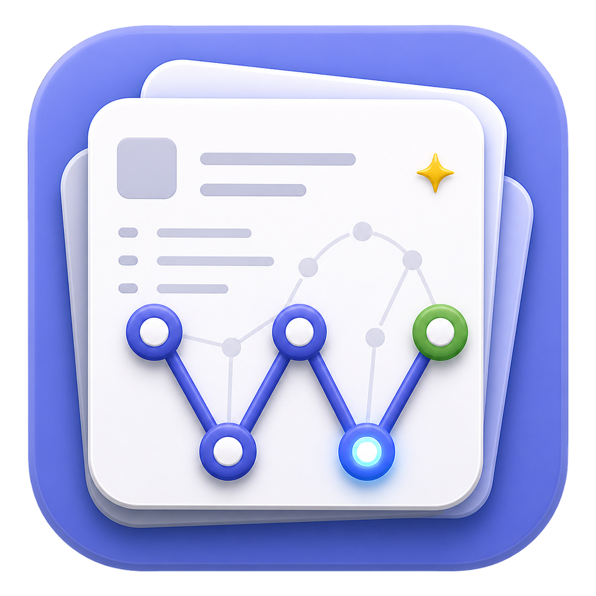
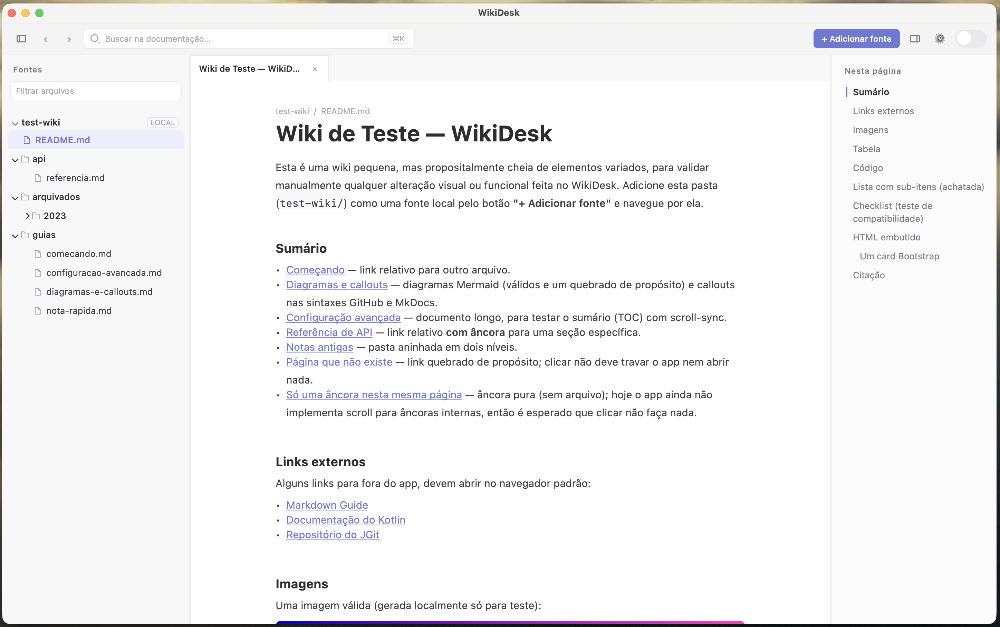
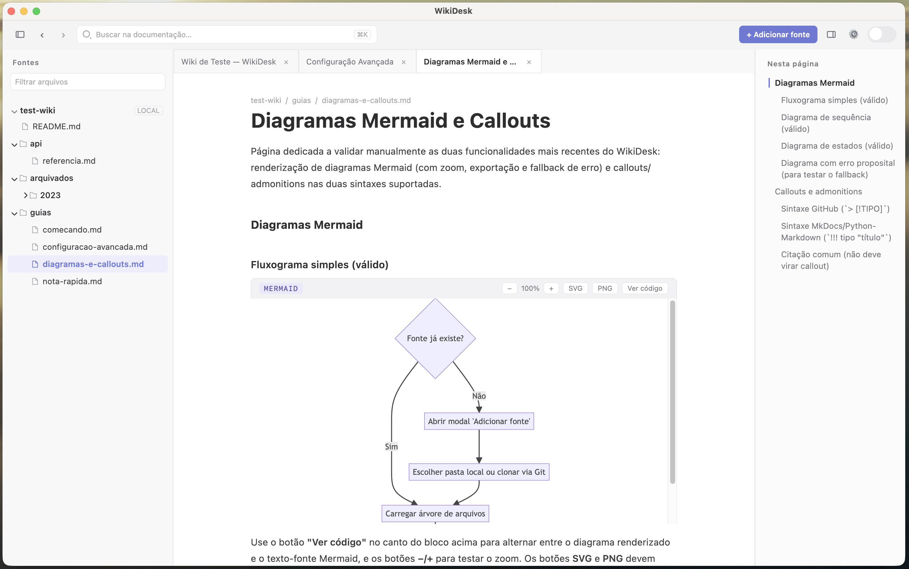
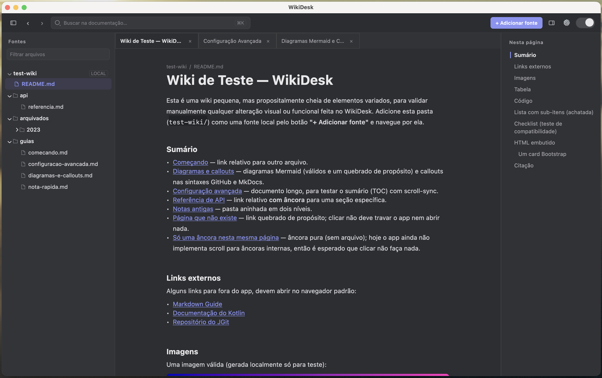
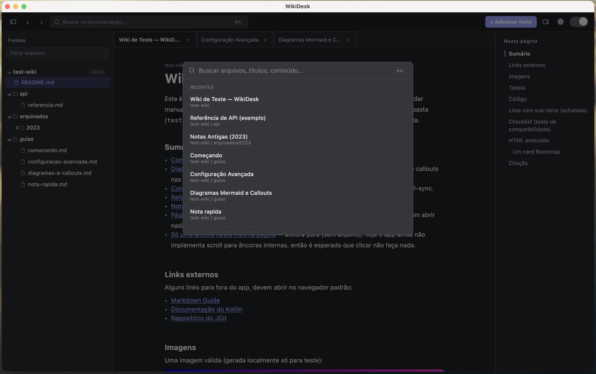
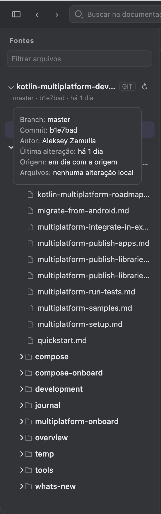

<p align="center">
  
</p>

# WikiDesk

Leitor de documentação Markdown para desktop. Aponte para qualquer pasta com arquivos `.md` — uma wiki local, um repositório clonado, um vault — e leia com navegação, busca e diagramas renderizados. Offline, sem servidor, sem conta.



## Recursos

- **Múltiplas fontes** — abra várias pastas ao mesmo tempo na barra lateral, incluindo clone direto de repositórios Git (HTTPS com token ou SSH), sem precisar do `git` instalado.
- **Rastreio Git** — para fontes que são repositórios: branch, último commit, commits à frente/atrás da origem e arquivos alterados localmente, com botão de atualizar (`git pull`).
- **Diagramas Mermaid** — renderizados com o mermaid.js real (Chromium embutido), com zoom, exportação SVG/PNG e erros de sintaxe apontando a linha exata.
- **Callouts** — sintaxes GitHub (`> [!NOTE]`) e MkDocs (`!!! note "Título"`).
- **Busca global** — `⌘K` / `Ctrl+K` busca em títulos e conteúdo de todos os documentos abertos.
- **Sumário com scroll-sync** — o índice à direita acompanha a leitura e navega ao clicar.
- **Abas e histórico** — navegação com voltar/avançar como em um navegador.
- **Tema claro e escuro.**

| | |
|---|---|
|  |  |
|  |  |

## Download

Baixe o instalador mais recente na página de [Releases](https://github.com/Erivelto47/wikidesk/releases): `.dmg` (macOS), `.msi` (Windows) ou `.deb` (Linux). A cada tag `v*` os três binários são gerados e publicados automaticamente.

> **Nota:** o app não é assinado. No macOS, clique com o botão direito → **Abrir** na primeira vez (ou libere em Ajustes → Privacidade e Segurança); no Windows, clique em "Mais informações" → "Executar assim mesmo" no SmartScreen.
>
> Na primeira vez que um diagrama Mermaid for exibido, o app baixa o motor de renderização (~100 MB, uma única vez).

## Rodando do código-fonte

Requisitos: JDK 17+ no PATH (o build baixa o toolchain correto automaticamente).

```bash
git clone https://github.com/Erivelto47/wikidesk.git
cd wikidesk
./gradlew run
```

Ao rodar pela raiz do projeto, a wiki de exemplo `test-wiki/` abre automaticamente — ela exercita todos os recursos (diagramas, callouts, tabelas, links relativos, um link quebrado de propósito etc.).

Para gerar o instalador nativo localmente:

```bash
./gradlew packageDmg   # macOS   → build/compose/binaries/main/dmg/
./gradlew packageMsi   # Windows → build/compose/binaries/main/msi/
./gradlew packageDeb   # Linux   → build/compose/binaries/main/deb/
```

## Stack

Kotlin + Compose Multiplatform Desktop · JGit (clone/pull/status sem git externo) · KCEF (Chromium embutido, só para Mermaid) · parser Markdown próprio, sem dependências.

## Licença

[MIT](LICENSE) — use, modifique e redistribua livremente, inclusive em ambiente corporativo.
