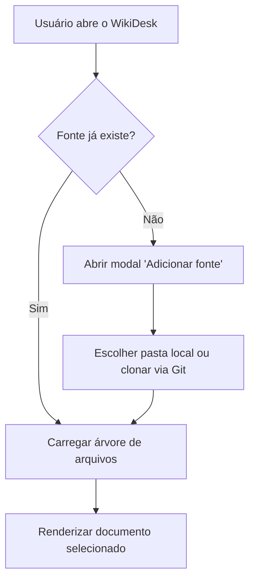
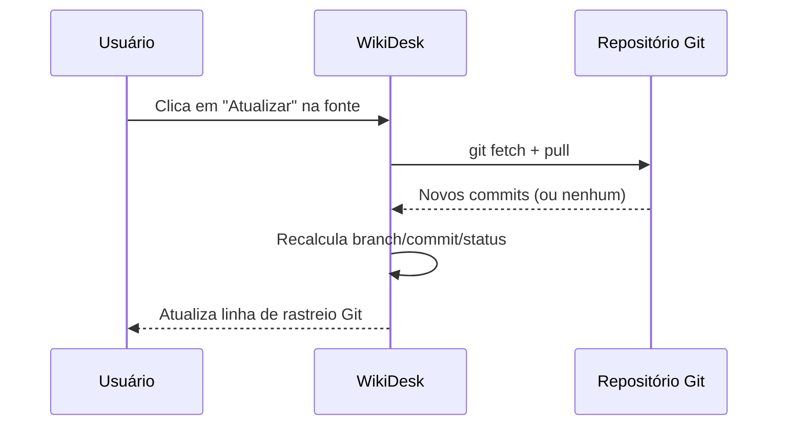
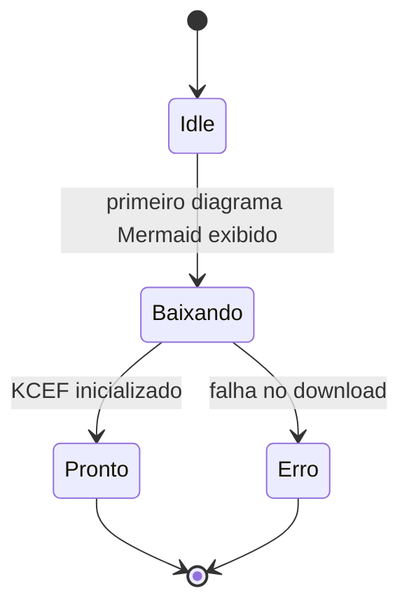

# Diagramas Mermaid e Callouts

Página dedicada a validar manualmente as duas funcionalidades mais recentes
do WikiDesk: renderização de diagramas Mermaid (com zoom, exportação e
fallback de erro) e callouts/admonitions nas duas sintaxes suportadas.

## Diagramas Mermaid

### Fluxograma simples (válido)



Use o botão **"Ver código"** no canto do bloco acima para alternar entre o
diagrama renderizado e o texto-fonte Mermaid, e os botões **−/+** para
testar o zoom. Os botões **SVG** e **PNG** devem abrir o diálogo nativo de
salvar arquivo.

### Diagrama de sequência (válido)



### Diagrama de estados (válido)



### Diagrama com erro proposital (para testar o fallback)

O bloco abaixo tem uma sintaxe Mermaid inválida de propósito (uma seta mal
formada). Deve aparecer o fallback legível com o código-fonte destacando a
linha do erro, em vez de travar a página ou mostrar uma tela em branco.

```mermaid
graph TD
    A[Início] --> B[Meio]
    B -->> C[Fim]
    C --> D[[Sintaxe quebrada de propósito]]
```

## Callouts e admonitions

### Sintaxe GitHub (`> [!TIPO]`)

> [!NOTE]
> Isto é uma nota informativa. Deve renderizar com o ícone ℹ e a cor de
> destaque azul, título "Nota".

> [!TIP]
> Uma dica também deve virar o estilo de **sucesso** (✓), já que "tip" é
> mapeado para a categoria de sucesso.

> [!WARNING]
> Atenção: isto deve renderizar com o ícone ⚠ e a cor de destaque âmbar,
> título "Atenção".

> [!CAUTION]
> "Caution" também deve mapear para a categoria de atenção (⚠).

> [!IMPORTANT]
> "Important" deve mapear para a categoria de sucesso (✓), junto com
> tip/hint/check/done.

### Sintaxe MkDocs/Python-Markdown (`!!! tipo "título"`)

!!! note "Observação do time"
    Este admonition usa um título customizado entre aspas. O corpo pode ter
    mais de uma linha, desde que indentada com 4 espaços.

    Inclusive uma segunda linha separada por uma linha em branco no meio.

!!! warning
    Este não tem título explícito — deve cair no título padrão "Atenção".

!!! success "Build passou"
    Todos os testes automatizados passaram nesta versão.

!!! danger "Risco de perda de dados"
    Apagar esta fonte remove os arquivos clonados localmente também.

!!! error
    Sem título explícito — deve cair no título padrão "Erro".

### Citação comum (não deve virar callout)

> Esta é só uma citação normal, sem marcador `[!TIPO]` — deve continuar
> renderizando como bloco de citação comum, não como callout colorido.

---

[Voltar para a página inicial](../README.md)
